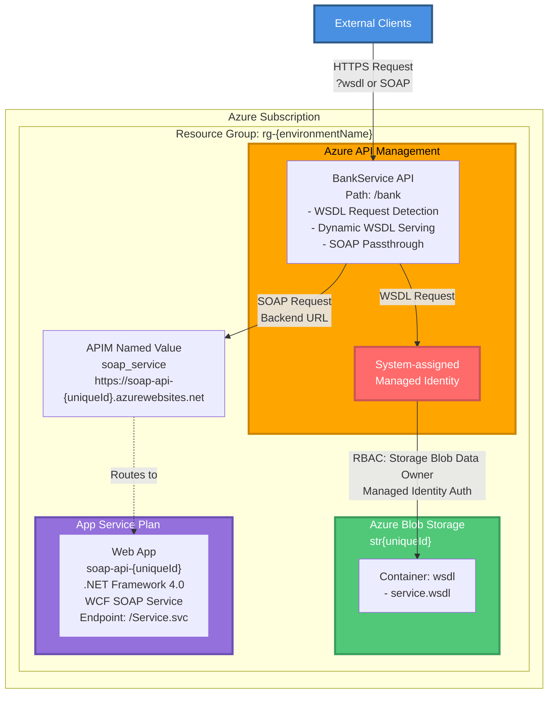
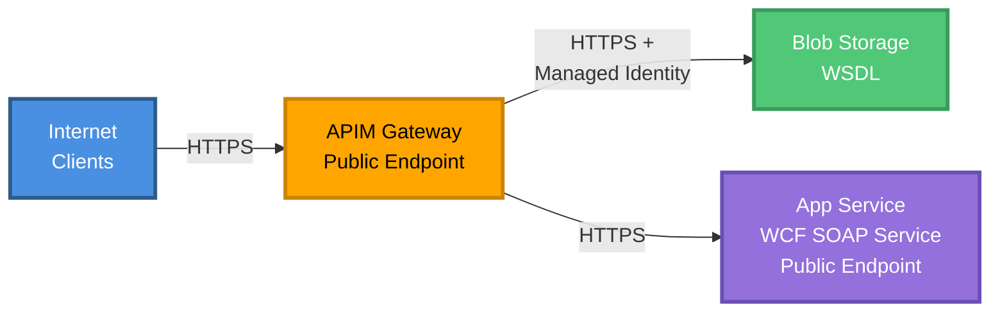

# Azure Architecture

This document explains the complete Azure infrastructure deployed by this solution and how all components work together to implement the **APIM passthrough gateway pattern**.

## Overview

This solution demonstrates how to use Azure API Management as a **passthrough gateway** for legacy SOAP services, addressing the challenge of complex WSDL imports while maintaining full compatibility with existing SOAP clients.

**Key Pattern**: 
- WSDL served from Azure Blob Storage (workaround for WSDLs with external schemas)
- SOAP operations passed through APIM to backend (no transformation)
- Backend can be Azure App Service, on-premises, or any SOAP endpoint
- Additional policies can be layered on top without backend changes

## Architecture Diagram

## Network Architecture

